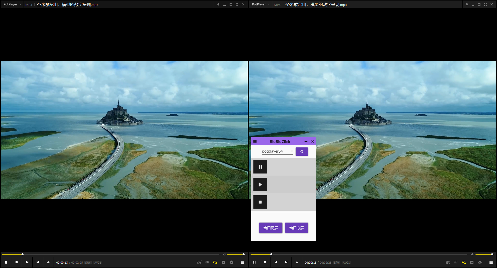

# BiubiuClick  

这是一个用于在Windows平台对比两个视频时控制同步播放的工具，它可以让你一键播放两个视频。


# 功能  
* 默认支持 [PotPlayer](https://potplayer.daum.net/) 播放器
* 一键控制两个播放器同时播放、暂停或停止
* 一键将屏幕平分展示两个窗口
* 一键将两个窗口移动到两个屏幕上，并且全屏

# 依赖  

* Windows 10
* 需要安装 .Net Framework 4.7.2 ([微软官方下载](https://support.microsoft.com/en-us/topic/microsoft-net-framework-4-7-2-offline-installer-for-windows-05a72734-2127-a15d-50cf-daf56d5faec2))

# 原理  

通过发送快捷键给进程实现控制播放器。

# 扩展性  

* 理论上可支持所有支持快捷键的播放器 
* 程序采用动态加载配置实现可扩展性，用户可以通过增加配置实现对其他播放器的支持
 
# 添加播放器支持 

通过增加配置文件的方式添加其他播放器支持：  

1. 进入程序安装目录
2. app/config/ 下新建文件夹，请用播放器的英文名称命名，例如 demoplayer
3. 进入新建的目录
4. 添加控制按钮图片，图片仅支持png格式，一张图片表示一个按钮，图片命名规则为“播放器名称-按钮名称”，命名全部使用英文，例如potplayer-play.png
5. 新建配置文件 config.ini，也可以复制 app/config/potplayer/config.ini 
6. 编辑config.ini文件内容，内容如下

``` ini
[common]
; className 要对齐的窗口类，使用AutoIt Window Info（下载地址：https://www.autoitscript.com/site/autoit/downloads/） 获取窗口类，不要想当然设置
className=PotPlayer
    ; macthTitleFromRight 是否从右侧匹配窗口标题，0:从左侧匹配 1:从右侧匹配
macthClassNameFromRight=1
; processName 进程名称
processName=PotPlayerMini
; keys 快捷键设置
; 对应播放器的快捷键，将播放器的快捷键转换为程序可理解的配置
; 注意快捷键与播放器快捷键保持一致，修改播放器快捷键后，需要修改此处配置，否则本软件控制功能会失效
; 键值使用双引号引起来
; 分两次按的快捷键使用英文逗号分隔，中间不要加空格
; 组合键，SHIFT	对应"+"，CTRL对应"^"，ALT对应"%"，CTRL+F1的键值为"^{F1}"
; 要指定在按下几个其他键时应按住 SHIFT、CTRL 和 ALT 的任意组合，请将这些键的代码括在括号中。
; 例如，要指定在按下 E 和 C 时按住 SHIFT，请使用“+(EC)”。要指定在按下 E 时按住 SHIFT，然后按下 C 而不使用 SHIFT，请使用“+EC”。
; 空格键打一个空格，其他键值的定义见 https://docs.microsoft.com/en-us/dotnet/api/system.windows.forms.sendkeys?view=windowsdesktop-6.0
[keys]
; 暂停 空格
pause= 
; 播放 空格
play= 
; 停止 potplayer无停止快捷键，使用暂停和定位到0帧模拟停止，以下配置的含义是：先按空格，再按退格键
stop= ,{BACKSPACE}
; 属性 ALT+F1
property=^{F1}
```   

7. app下完整的目录结构为   

``` 
+---app
|   \---config
|       \---potplayer
|               config.ini
|               potplayer-pause.png
|               potplayer-play.png
|               potplayer-property.png
|               potplayer-stop.png
```

# 说明  

* 目前仅在Windows 10下测试过，对其他Windows版本兼容性未知。

# 已知问题  

* [ ] 分屏显示与显示器排列顺序相关，如果已经连接两个显示器，但分屏无法正常工作，可在***系统设置/显示设置*** 中 **重新排列显示器顺序**试试。
* [ ] 两个视频同步播放存在几百毫秒左右延迟。 
 
# TODO

* [ ] 关于、帮助窗口显示优化  
* [ ] 自动升级
 


